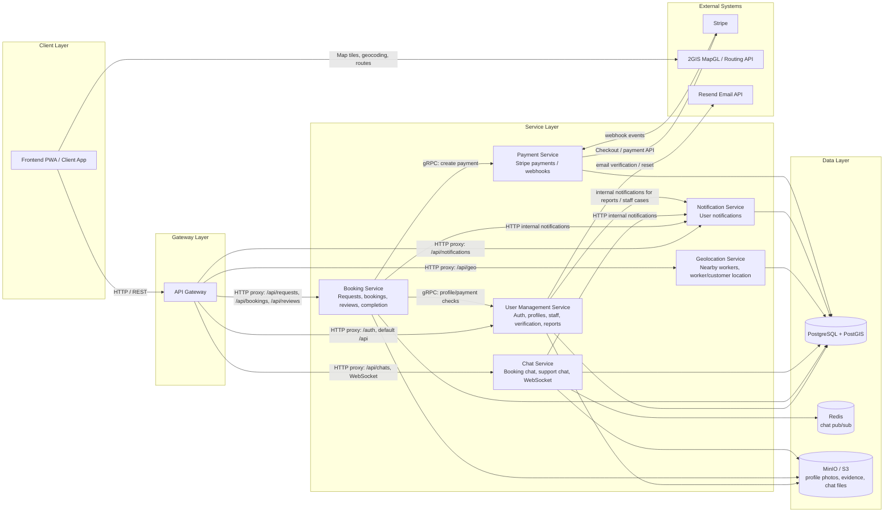

Workers-Marketplace-Platform

## Architecture

### Storage Usage

- `usermanagement-service` stores profile photos, worker skill evidence, identity documents, and report attachments in MinIO/S3.
- `booking-service` stores completion evidence and review photos in MinIO/S3.
- `chat-service` stores chat attachments in MinIO/S3.
- `chat-service` uses Redis for WebSocket pub/sub between service instances.
- `PostgreSQL + PostGIS` is the shared relational and geospatial database.

### Main Communication Types

- Frontend talks to backend through `api-gateway` over HTTP.
- `api-gateway` routes public API calls to the correct service.
- `booking-service` uses gRPC for required internal calls to `usermanagement-service` and `payment-service`.
- `notification-service` is called through internal HTTP endpoints by services that need to create notifications.
- 2GIS is used from the frontend for maps, routing, geocoding, and map rendering.
- Stripe is used by `payment-service` for payments and webhooks.
